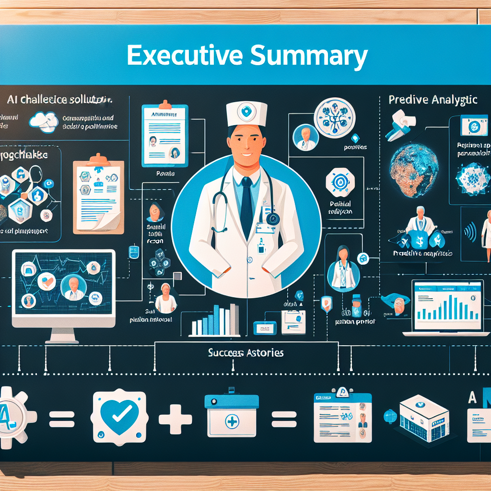
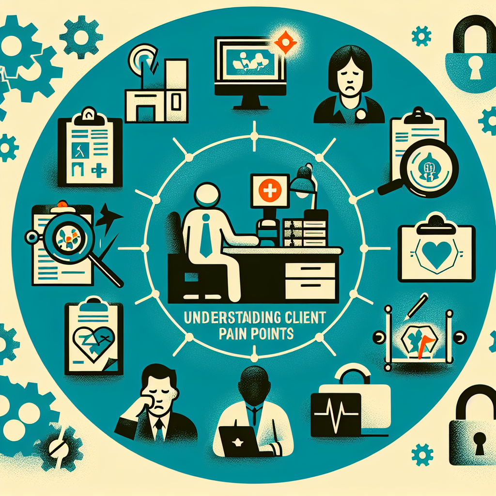
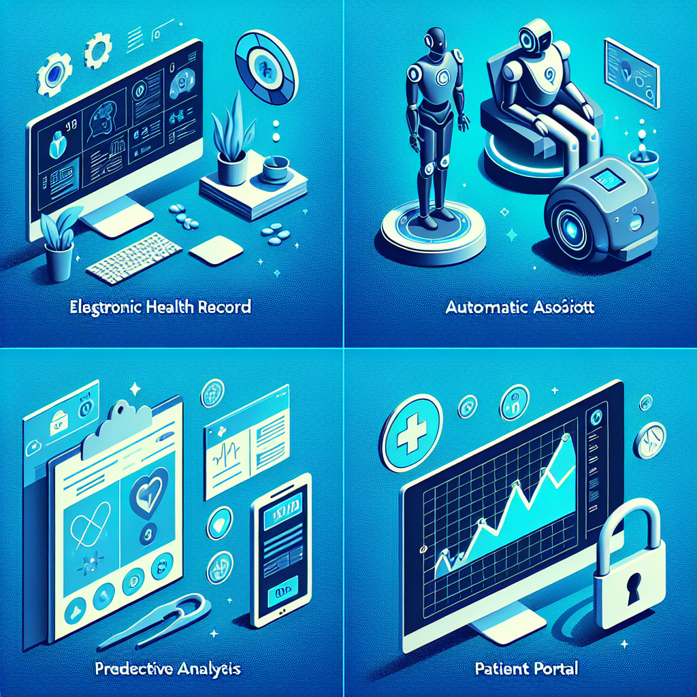
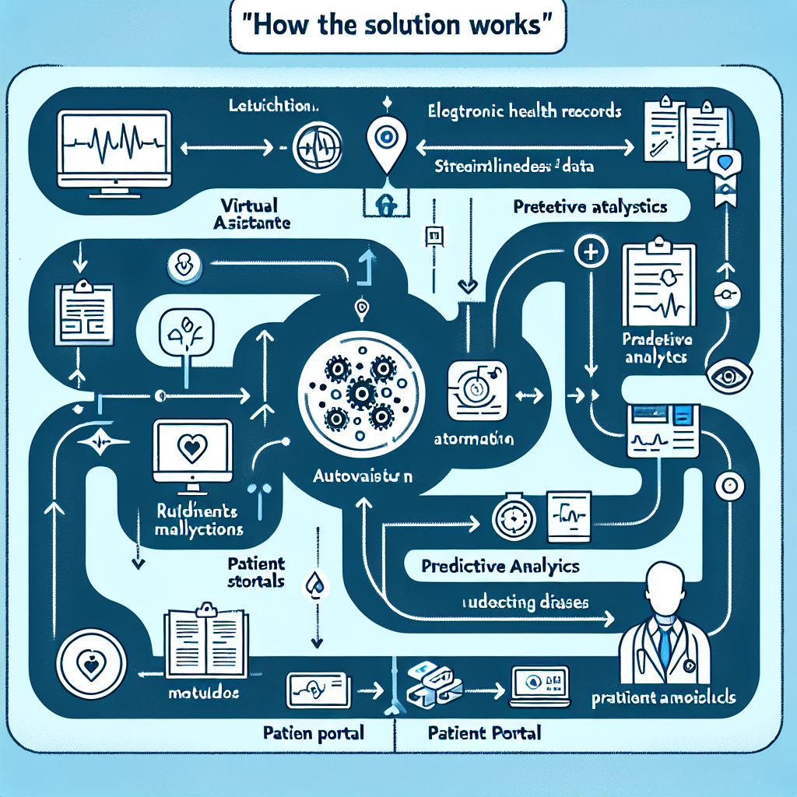
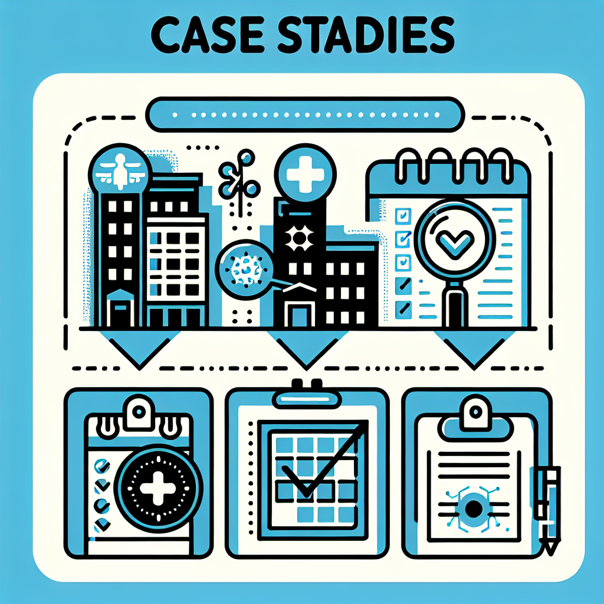
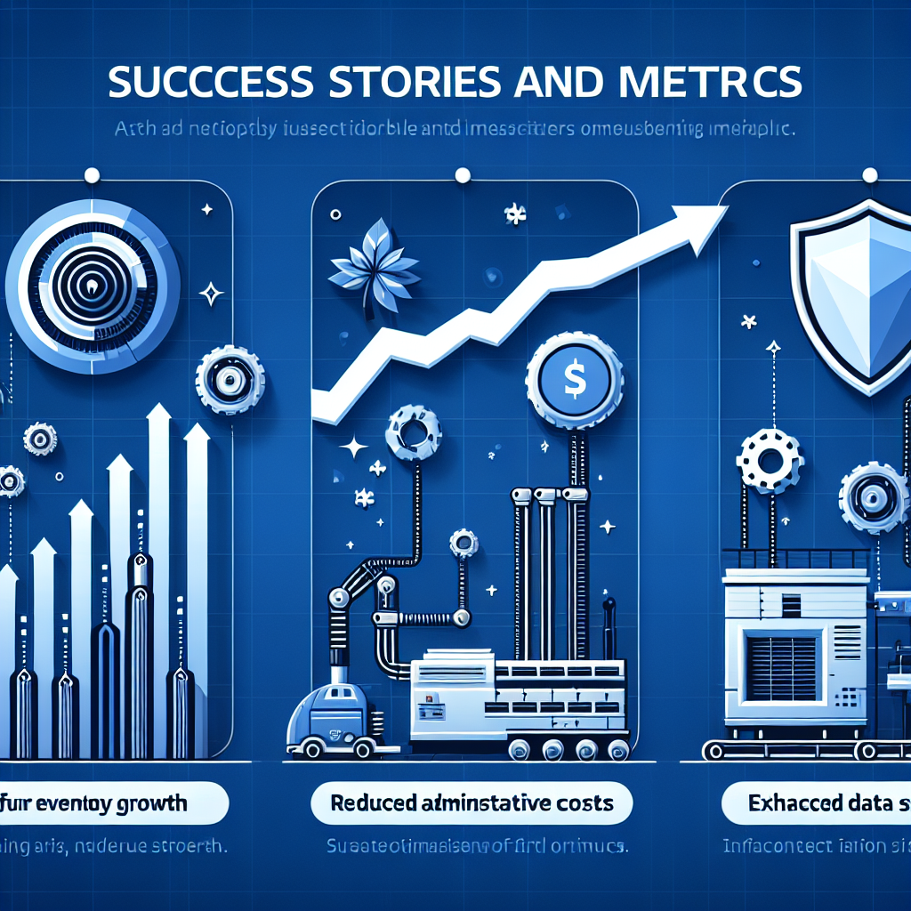

# Executive Summary

Our proposal aims to address the key challenges faced by your healthcare organization, including inefficient patient data management, high administrative workload, difficulty in early disease detection, limited access to real-time patient insights, and privacy concerns. We propose an AI-powered solution that includes an Electronic Health Record (EHR) system, a virtual assistant, a predictive analytics module, and a secure patient portal. Our solution is backed by successful case studies and success stories, demonstrating our ability to deliver results.

# Understanding Client Pain Points

- Inefficient patient data management and retrieval
- High administrative workload for healthcare professionals
- Difficulty in early disease detection and diagnosis
- Limited access to real-time patient insights
- Privacy and security concerns related to patient data

# Solution Overview

Our solution comprises four key components:

1. AI-driven Electronic Health Record (EHR) system
2. Virtual assistant for administrative tasks
3. Predictive analytics module for disease detection
4. Secure patient portal for real-time access to medical records

# How the Solution Works

1. The AI-driven EHR system streamlines data management and retrieval, reducing errors and improving patient care.
2. The virtual assistant automates administrative tasks, freeing up healthcare professionals to focus on patient care.
3. The predictive analytics module uses AI to detect diseases early, improving patient outcomes.
4. The secure patient portal provides real-time access to medical records, enhancing patient engagement and satisfaction.

# Case Studies

1. Enhanced Patient Care: Our AI-powered EHR system reduced hospital readmissions by 20%.
2. Administrative Efficiency: Our virtual assistant increased appointment scheduling efficiency by 30%.
3. Disease Detection: Our predictive analytics module increased early-stage diagnoses by 40%.

# Success Stories and Metrics

1. Revenue Growth: Our solutions contributed to a 15% increase in revenue for a healthcare client.
2. Streamlined Operations: We helped a medical practice reduce administrative costs by 25%.
3. Data Security: Our advanced security measures ensured compliance and data security for a healthcare organization.

# Timeline, Costs, and Payment Terms

We propose a phased implementation over 12 months, with costs broken down as follows:

1. AI-driven EHR system: $X
2. Virtual assistant: $Y
3. Predictive analytics module: $Z
4. Secure patient portal: $W

Payment terms are flexible and can be discussed further.

# Conclusion

Our AI-powered solution addresses your key pain points, backed by proven case studies and success stories. We look forward to partnering with you to enhance patient care, streamline operations, and secure patient data.

